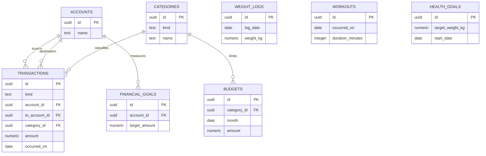

# Database Design

## Conventions

The database is PostgreSQL on Neon in the `public` schema. Business tables belong to one authenticated owner's data set. Phase 5 adds Better Auth tables named `auth_user`, `auth_session`, `auth_account`, and `auth_verification`; they have no foreign keys to business tables. FastAPI accepts only the configured owner ID. Multi-user ownership/isolation remains out of scope.

- Primary keys are UUIDs. Client-created POST resources use a UUID supplied by the desktop so a timed-out request can be checked or retried with the same ID. Server-created IDs, such as a first daily log if needed, use PostgreSQL or Python UUID generation consistently.
- Every table has `created_at timestamptz NOT NULL` and `updated_at timestamptz NOT NULL`. The backend/database supplies UTC timestamps.
- Activity and reporting dates use PostgreSQL `date` and represent `Asia/Bangkok` calendar dates.
- Money uses `numeric(14,2)`, mapped to Python `Decimal` and serialized as a JSON decimal string such as `"1250.50"`. PostgreSQL `numeric` is exact and avoids binary floating-point errors.
- Weight uses `numeric(5,2)` in kilograms. Durations and counts use integer types.
- Enum-like values use `text` with `CHECK` constraints. This keeps migrations simple while preserving valid values.
- Foreign keys use `ON DELETE RESTRICT`. The service decides whether an archive or delete is allowed.
- Names are trimmed and limited to 100 characters. Notes are nullable and limited to 2,000 characters.
- V1 has no general soft-delete column. Accounts, categories, and goals use `archived_at`; transactions, budgets, weight logs, and workouts are hard-deleted only after confirmation.

## Tables

### `accounts`

| Column | Type | Rules |
|---|---|---|
| `id` | uuid | PK |
| `name` | text | required, trimmed, unique |
| `kind` | text | required; `cash`, `bank`, or `ewallet` |
| `opening_balance` | numeric(14,2) | required; negative values allowed |
| `opening_date` | date | required, not future |
| `archived_at` | timestamptz | nullable |
| `created_at`, `updated_at` | timestamptz | required |

An account with transactions cannot change its opening balance or opening date. An archived account remains reportable but cannot be selected for a new transaction.

### `categories`

| Column | Type | Rules |
|---|---|---|
| `id` | uuid | PK |
| `name` | text | required, trimmed |
| `kind` | text | required; `income` or `expense` |
| `archived_at` | timestamptz | nullable |
| `created_at`, `updated_at` | timestamptz | required |

Unique constraint: `(kind, name)`. A category's kind cannot change after it is referenced. Archived categories remain usable for historical rows but are not valid for new rows.

### `transactions`

| Column | Type | Rules |
|---|---|---|
| `id` | uuid | PK |
| `kind` | text | required; `income`, `expense`, or `transfer` |
| `account_id` | uuid | required FK to `accounts` |
| `to_account_id` | uuid | nullable FK to `accounts` |
| `category_id` | uuid | nullable FK to `categories` |
| `amount` | numeric(14,2) | required, greater than zero |
| `occurred_on` | date | required, not future |
| `note` | text | nullable, max 2,000 chars |
| `created_at`, `updated_at` | timestamptz | required |

For income and expense, `category_id` is required and `to_account_id` is null. For transfer, `to_account_id` is required, differs from `account_id`, and `category_id` is null. A transfer is stored in one row; it increases the destination balance and decreases the source balance.

### `budgets`

| Column | Type | Rules |
|---|---|---|
| `id` | uuid | PK |
| `category_id` | uuid | required FK to an expense category |
| `month` | date | required; first day of a calendar month |
| `amount` | numeric(14,2) | required, greater than zero |
| `created_at`, `updated_at` | timestamptz | required |

Unique constraint: `(category_id, month)`. The service and a category-kind constraint ensure only expense categories can be budgeted.

### `weight_logs`

| Column | Type | Rules |
|---|---|---|
| `id` | uuid | PK |
| `log_date` | date | required, unique, not future |
| `weight_kg` | numeric(5,2) | nullable, 1.00–500.00 |
| `note` | text | nullable, max 2,000 chars |
| `created_at`, `updated_at` | timestamptz | required |

At least one of `weight_kg` or a non-empty `note` is required. The unique date constraint makes the API's `PUT /weight-logs/{date}` an upsert.

### `workouts`

| Column | Type | Rules |
|---|---|---|
| `id` | uuid | PK |
| `occurred_on` | date | required, not future |
| `activity_type` | text | required; `walk`, `run`, `cycle`, `strength`, or `other` |
| `duration_minutes` | integer | required, 1–1,440 |
| `note` | text | nullable, max 2,000 chars |
| `created_at`, `updated_at` | timestamptz | required |

### `financial_goals`

| Column | Type | Rules |
|---|---|---|
| `id` | uuid | PK |
| `name` | text | required, trimmed |
| `account_id` | uuid | required FK to `accounts` |
| `baseline_amount` | numeric(14,2) | required |
| `target_amount` | numeric(14,2) | required and greater than baseline |
| `start_date` | date | required, not future |
| `due_date` | date | nullable and not before start date |
| `archived_at` | timestamptz | nullable |
| `created_at`, `updated_at` | timestamptz | required |

Progress is derived from the account balance on or after `start_date`; it is not stored.

### `health_goals`

| Column | Type | Rules |
|---|---|---|
| `id` | uuid | PK |
| `name` | text | required, trimmed |
| `baseline_weight_kg` | numeric(5,2) | required, 1.00–500.00 |
| `target_weight_kg` | numeric(5,2) | required, 1.00–500.00, different from baseline |
| `start_date` | date | required, not future |
| `due_date` | date | nullable and not before start date |
| `archived_at` | timestamptz | nullable |
| `created_at`, `updated_at` | timestamptz | required |

Progress uses the latest weight log on or after `start_date`; it is not stored.

## Relationships

`weight_logs`, `workouts`, and `health_goals` are related by dates and service calculations rather than foreign keys. This is intentional: a workout or weight record can exist independently of a goal.

## Constraints and indexes

PostgreSQL constraints enforce positive money, valid enum values, valid health ranges, unique account/category names where specified, unique budget month/category, unique weight-log date, goal date order, and transfer shape. Service validation additionally checks account opening dates, archive state, category type, current date, and cross-row rules.

Initial indexes:

- `transactions (occurred_on DESC, id DESC)` for recent lists.
- `transactions (account_id, occurred_on)` and `transactions (to_account_id, occurred_on)` for balance calculation.
- `transactions (category_id, occurred_on)` for category summaries.
- `budgets (month, category_id)` for dashboard budget comparison.
- `workouts (occurred_on DESC, id DESC)` for recent health lists.
- `financial_goals (account_id)` for goal progress.
- Unique index on `weight_logs (log_date)`.

Do not index every filterable column. Use query plans and measured slow queries before adding more indexes.

## Timestamp and date rules

The backend/database writes `created_at` and `updated_at` in UTC. User-facing finance and health dates are date-only values in `Asia/Bangkok`. The API accepts and returns explicit ISO dates and UTC timestamps. Reporting month boundaries are calculated in the configured application timezone before querying date columns.

## Migration strategy

Alembic is the authoritative business schema history. The initial migration creates all eight business tables, constraints, indexes, and seed categories. Each later business schema change updates the SQLAlchemy model and adds a reviewed forward migration. Phase 5's Better Auth service manages its four prefixed auth tables separately through `npm run migrate` in `apps/auth`, using the installed/pinned library schema and a direct migration connection. Neither service auto-migrates on startup. Backups are taken before production migrations.
